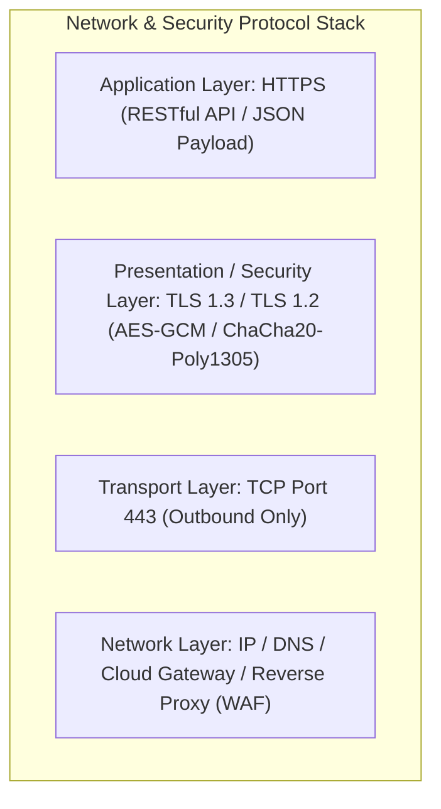
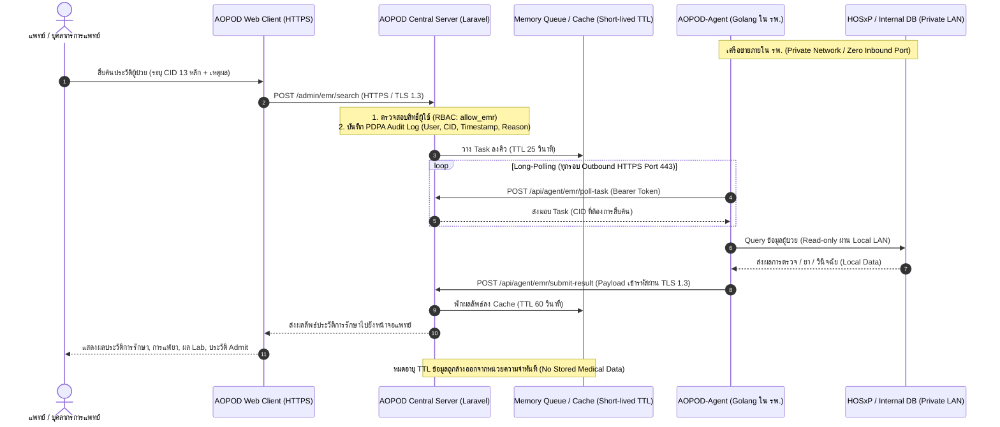

# เอกสารสถาปัตยกรรมความมั่นคงปลอดภัยสารสนเทศและการเชื่อมโยงข้อมูลระบบ A-EMR
## (A-EMR Cybersecurity Architecture & Network Protocol Specification)

---

### บทสรุปสำหรับผู้บริหาร (Executive Summary)

ระบบ **A-EMR (AOPOD Electronic Medical Record)** เป็นระบบเชื่อมโยงและสืบค้นข้อมูลประวัติสุขภาพผู้ป่วยระหว่างสถานพยาบาลแบบ Real-time On-demand ได้รับการออกแบบภายใต้หลักการ **Security by Design** และ **Zero Trust Network Architecture (ZTNA)** เพื่อตอบโจทย์เกณฑ์มาตรฐานความมั่นคงปลอดภัยไซเบอร์ระดับประเทศ (สกมช./NCSA), เกณฑ์ความปลอดภัยกระทรวงสาธารณสุข (MOPH Cybersecurity Standard) และพระราชบัญญัติคุ้มครองข้อมูลส่วนบุคคล พ.ศ. 2562 (PDPA)

จุดเด่นสำคัญด้านความปลอดภัย:
1. **Zero-Port Inbound Architecture**: โรงพยาบาลต้นทางไม่ต้องเปิดพอร์ตขาเข้า (0 Open Inbound Ports) ไม่ต้องมี Public IP และไม่ต้องตั้งค่า Port Forwarding
2. **End-to-End Transport Security**: การรับส่งข้อมูลทั้งหมดทำงานผ่าน **HTTPS บนโปรโตคอล TLS 1.3 / TLS 1.2** ที่มีการเข้ารหัสแบบขั้นสูงพร้อมคุณสมบัติ Perfect Forward Secrecy (PFS)
3. **No Central Medical Repository**: เซิร์ฟเวอร์กลางไม่มีการเก็บประวัติการรักษาผู้ป่วยไว้อย่างถาวร ข้อมูลจะพักในหน่วยความจำชั่วคราว (Memory Cache TTL 20–60 วินาที) เฉพาะขณะที่แพทย์เปิดดูเท่านั้น
4. **Audit Trail & Role-Based Access**: มีการควบคุมสิทธิ์อย่างเข้มงวด (RBAC) และบันทึก Log การเข้าถึงข้อมูลเวชระเบียนทุกครั้งตามข้อกำหนด PDPA

---

### 1. สรุปโปรโตคอลและระดับชั้นการรักษาความปลอดภัยเครือข่าย (Network & Protocols)

#### 1.1 ตารางรายละเอียดโปรโตคอล (Protocol Specifications)

| หัวข้อ | รายละเอียดทางเทคนิค | คำอธิบายด้านความปลอดภัย |
| :--- | :--- | :--- |
| **Application Protocol** | **HTTPS (HTTP/1.1 หรือ HTTP/2 over TLS)** | รับส่งข้อมูลในรูปแบบ JSON RESTful Payload |
| **Transport Protocol** | **TCP พอร์ต 443 (Outbound Destination Only)** | สื่อสารเฉพาะทิศทางขาออก (Outbound) จาก รพ. สู่เซิร์ฟเวอร์กลาง |
| **TLS Version** | **TLS 1.3 (Primary / Preferred)** *Fallback: TLS 1.2 (Minimum baseline)* | ไม่อนุญาตให้ใช้ SSLv2, SSLv3, TLS 1.0, TLS 1.1 โดยเด็ดขาด |
| **Key Exchange** | **ECDHE (Elliptic Curve Diffie-Hellman Ephemeral)** เช่น `X25519`, `secp256r1` | รองรับ **Perfect Forward Secrecy (PFS)** ป้องกันการดักฟังและถอดรหัสย้อนหลัง |
| **Cipher Suites (TLS 1.3)** | 1. `TLS_AES_128_GCM_SHA256` 2. `TLS_AES_256_GCM_SHA384` 3. `TLS_CHACHA20_POLY1305_SHA256` | การเข้ารหัสแบบ Authenticated Encryption with Associated Data (AEAD) |
| **Cipher Suites (TLS 1.2)** | `ECDHE-ECDSA-AES128-GCM-SHA256` `ECDHE-RSA-AES128-GCM-SHA256` `ECDHE-RSA-AES256-GCM-SHA384` | ปิดการใช้งาน Cipher ที่อ่อนแอ (เช่น CBC Mode, 3DES, RC4, MD5) ทั้งหมด |
| **Digital Certificate** | **X.509 Certificate (2048-bit RSA หรือ 256-bit ECC)** | ออกโดย CA ที่น่าเชื่อถือ (Trusted Public Certificate Authority) |

---

### 2. สถาปัตยกรรมการเชื่อมโยง (Architecture & Data Flow)

#### 2.1 แผนภาพการเชื่อมต่อแบบ Zero-Port Architecture

---

### 3. มาตรการความมั่นคงปลอดภัยสารสนเทศ 5 ด้าน (5 Pillars of Cybersecurity)

#### 3.1 Network & Perimeter Security (ความปลอดภัยระบบเครือข่าย)
* **Zero Inbound Attack Surface**: ไฟร์วอลล์ของโรงพยาบาลไม่ต้องเปิดรับการเชื่อมต่อจากภายนอก จึงไม่มีจุดเสี่ยงต่อการถูก Port Scanning, Brute Force หรือ Exploitation ข้ามเครือข่าย
* **Firewall Friendly**: โปรแกรม Agent ทำหน้าที่เป็น Client ส่งคำขอขาออก (Outbound HTTPS Port 443) เท่านั้น สามารถทำงานร่วมกับ Corporate Proxy, NAT และ Next-Generation Firewall (NGFW) ได้ทันที
* **Subnet Isolation**: Agent สื่อสารกับฐานข้อมูล HOSxP ภายในวงแลนจำกัดสิทธิ์ (VLAN/Database Subnet) ไม่มีการเปิดเผยฐานข้อมูลสู่ภายนอก

#### 3.2 Authentication & Authorization (การยืนยันตัวตนและการควบคุมสิทธิ์)
* **Agent-to-Cloud Authentication**:
  * ใช้ **API Token (Laravel Sanctum Bearer Token)** ที่มีการระบุขอบเขตความสามารถชัดเจน (`abilities: ["ingest"]`)
  * **Hospital Code Validation**: ระบบตรวจสอบความถูกต้องระหว่าง Token และรหัสสถานพยาบาล 5 หลัก (`hospcode`) หากพบว่า Token ไม่ตรงกับรหัส รพ. จะทำการปฏิเสธคำขอทันที (HTTP 403 Forbidden)
* **User-to-System Access Control**:
  * การเข้าถึงหน้าจอเวชระเบียนต้องผ่านการล็อกอินแบบยืนยันตัวตนรายบุคคล
  * มีระบบ **Role-Based Access Control (RBAC)** โดยจำกัดเฉพาะผู้ใช้ที่มีสิทธิ์ `allow_emr = 1` หรือระดับ `admin`
  * รองรับการเชื่อมต่อยืนยันตัวตนบุคลากรสาธารณสุขผ่าน **MOPH Provider ID**

#### 3.3 Data Protection (การคุ้มครองข้อมูลระหว่างรับส่งและจัดเก็บ)
* **Data in Transit**: เข้ารหัสข้อมูลตลอดการเดินทางผ่านเครือข่ายด้วย **TLS 1.3 / TLS 1.2** ด้วยชุดรหัสแบบ AEAD (เช่น AES-GCM 128/256-bit)
* **Data at Rest & Local Credentials**:
  * ข้อมูลรหัสผ่านฐานข้อมูลโรงพยาบาล (Database Host, User, Password) จะถูกเก็บไว้ในไฟล์ Configuration ภายในเครื่องของโรงพยาบาลเท่านั้น ไม่มีการส่งหรือจัดเก็บบนคลาวด์
* **Zero Persistent Central Storage**:
  * เซิร์ฟเวอร์กลาง **ไม่มีการจัดเก็บข้อมูลเวชระเบียนหรือประวัติการรักษาลงฐานข้อมูลถาวร**
  * ข้อมูลจะถูกเก็บในหน่วยความจำแคชแบบมีอายุขัยสั้น (Short-Lived Memory Cache: TTL 20–60 วินาที) เมื่อแพทย์ดูข้อมูลเสร็จ ข้อมูลจะหมดอายุและถูกทำลายอัตโนมัติ

#### 3.4 Audit Trail & PDPA Compliance (การบันทึกประวัติและความสอดคล้องกับ พ.ร.บ. คุ้มครองข้อมูลส่วนบุคคล)
* ทุกการสืบค้นข้อมูลเวชระเบียนจะต้องระบุ **เหตุผลความจำเป็นในการรักษาพยาบาล (Medical Purpose/Reason)**
* ระบบบันทึก **Audit Trail Log** ลงตารางฐานข้อมูลเฉพาะ **`emr_access_logs`** ครบถ้วนตามหลัก 5W1H:
  1. **วันและเวลา (When)**: บันทึก Timestamp ละเอียดระดับวินาที สอดคล้องกับ NTP Time Server มาตรฐาน
  2. **ผู้ใช้งาน (Who)**: บันทึก User ID, ชื่อ-สกุลบุคลากร, บทบาท (Role), รหัสหน่วยบริการต้นสังกัด (`user_hospcode`) และ Provider ID
  3. **การกระทำและเป้าหมาย (What & Whom)**: ประเภท Action (`SEARCH_CID`, `VIEW_VISIT_DETAIL`), เลขบัตรประชาชนผู้ป่วย (`target_cid`), รหัส `target_hn`, `target_vn` และ รหัสสถานพยาบาลปลายทาง
  4. **เหตุผลตาม PDPA (Why)**: บันทึกวัตถุประสงค์ในการเข้าถึง เช่น การตรวจรักษาทั่วไป, การส่งต่อ, กรณีฉุกเฉิน
  5. **สภาพแวดล้อมเครือข่าย (Where)**: หมายเลข IP Address ของผู้เข้าใช้, User-Agent และ Request URL
  6. **ผลลัพธ์และประสิทธิภาพ (Result & Performance)**: บันทึกสถานะ (`SUCCESS`, `NOT_FOUND`, `ERROR`), HTTP Status Code, จำนวนรายการที่พบ และเวลาประมวลผล (`response_time_ms`)
* **การจำกัดสิทธิ์และการตรวจสอบ (Access & Retention)**:
  * หน้าจอตรวจสอบ **Audit Logs (`/manage/emr/logs`)** ล็อกสิทธิ์เฉพาะผู้ดูแลระบบระดับสูง (**Admin Only**)
  * ตารางออกแบบเป็นแบบ **Append-Only** ป้องกันการแก้ไขย้อนหลัง
  * มีระบบส่งออกรายงานในรูปแบบ CSV/Excel สำหรับส่งรายงานการตรวจสอบด้านไซเบอร์และ DPO
  * กำหนดระยะเวลาจัดเก็บขั้นต่ำ **90 วัน ถึง 2 ปี** สอดคล้องกับ พ.ร.บ. ว่าด้วยการกระทำความผิดเกี่ยวกับคอมพิวเตอร์ พ.ศ. 2560 (มาตรา 26)

#### 3.5 Integrity & Reliability (ความถูกต้องสมบูรณ์และความพร้อมใช้งาน)
* **Idempotency & Replay Protection**: คำร้องขอแต่ละชุดจะมี Task ID แบบสุ่มและมีอายุกำหนด (`emr_pt_<timestamp>_<random>`) ป้องกันการส่งซ้ำ (Replay Attack)
* **Read-Only Database Operations**: กระบวนการ Query ข้อมูลจากฐานข้อมูลโรงพยาบาลเป็นคำสั่งอ่านข้อมูลเท่านั้น (`SELECT`) ไม่มีการแก้ไขหรือลบข้อมูลในระบบเวชระเบียนเดิม

---

### 4. ตารางตอบแบบประเมินความมั่นคงปลอดภัยไซเบอร์ (Security Assessment Checklist)

สำหรับใช้กรอกหรือแนบในแบบสอบถามด้านความปลอดภัย / จัดซื้อจัดจ้าง / การตรวจประเมินไซเบอร์:

| ข้อกำหนดความปลอดภัย | สถานะ | รายละเอียดคำตอบทางเทคนิค |
| :--- | :---: | :--- |
| **1. Protocol ที่ใช้ในการสื่อสาร** | **ผ่าน** | **HTTPS (RESTful API / JSON Payload)** |
| **2. มาตรฐานการเข้ารหัสข้อมูลขณะส่ง (Data in Transit)** | **ผ่าน** | **TLS 1.3 (Primary) และ TLS 1.2** พร้อมรองรับ Perfect Forward Secrecy (PFS - ECDHE) |
| **3. การเปิด Port ขาเข้าสู่เครือข่ายหน่วยงาน (Inbound Ports)** | **ผ่าน** | **0 Inbound Port (ไม่มีการเปิดพอร์ตใดๆ ขาเข้า)** ทำงานแบบ Outbound Polling สู่ Port 443 เท่านั้น |
| **4. การยืนยันตัวตนของโปรแกรมเชื่อมต่อ (Machine Auth)** | **ผ่าน** | **API Bearer Token (Laravel Sanctum)** พร้อมการตรวจสอบ `hospcode matching validation` |
| **5. การควบคุมสิทธิ์การเข้าถึงข้อมูลของผู้ใช้งาน (User Authorization)** | **ผ่าน** | มีระบบ **RBAC**, สิทธิ์ระดับฟิลด์ `allow_emr`, และระบบตรวจสอบสิทธิ์ก่อนส่งคำขอ |
| **6. นโยบายการจัดเก็บข้อมูลเวชระเบียนที่ศูนย์กลาง (Data Retention)** | **ผ่าน** | **ไม่จัดเก็บข้อมูลประวัติการรักษาถาวรที่ส่วนกลาง (Zero Persistent Storage)** ใช้ระบบ Temporary Memory Cache TTL 20-60 วินาที |
| **7. การเก็บบันทึกประวัติการเข้าถึง (Audit Trail Log)** | **ผ่าน** | บันทึก Log ลงตาราง **`emr_access_logs`** ครบ 5W1H (ผู้ใช้, CID, เหตุผล, IP, เวลา NTP, Latency) พร้อมหน้ารายงาน Audit Logs เฉพาะ Admin และเก็บย้อนหลัง >= 90 วัน ตาม พ.ร.บ. คอมฯ มาตรา 26 |
| **8. ความปลอดภัยของรหัสผ่านฐานข้อมูล (Credential Protection)** | **ผ่าน** | รหัสผ่านฐานข้อมูลเก็บในเครื่อง Agent ภายใน รพ. เท่านั้น ไม่ถูกส่งผ่านเครือข่าย |
| **9. ผลกระทบต่อฐานข้อมูลโรงพยาบาล (Database Impact)** | **ผ่าน** | ใช้คำสั่งแบบ **Read-only query** และมี Timeout ป้องกัน Database Resource Exhaustion |
| **10. มาตรฐานความปลอดภัยที่สอดคล้อง** | **ผ่าน** | สอดคล้องกับ **พ.ร.บ. ไซเบอร์ฯ (สกมช./NCSA), พ.ร.บ. คุ้มครองข้อมูลส่วนบุคคล (PDPA), พ.ร.บ. คอมพิวเตอร์ฯ มาตรา 26** และแนวทาง Smart Hospital ของ สธ. |

---

### 5. สรุปประโยคสำหรับใช้ในการนำเสนอหรือตอบข้อซักถาม (Quick Defense Summary)

> *"การเชื่อมโยงระบบ A-EMR ทำงานบนสถาปัตยกรรม **Zero-Port Outbound Architecture** โดยไม่มีการเปิดพอร์ต Firewall ขาเข้าสู่โรงพยาบาล ข้อมูลทั้งหมดถูกส่งผ่านช่องทางที่เข้ารหัสด้วย **HTTPS บนโปรโตคอล TLS 1.3 / TLS 1.2** พร้อมระบบยืนยันตัวตนด้วย API Token และการควบคุมสิทธิ์ผู้ใช้แบบ RBAC ระบบได้รับการออกแบบตามหลักการ **Privacy by Design** โดยไม่มีการจัดเก็บข้อมูลประวัติการรักษาผู้ป่วยไว้บนเซิร์ฟเวอร์กลางอย่างถาวร (พักข้อมูลใน Memory Cache ชั่วคราว 20–60 วินาที) และมีระบบบันทึก Audit Trail Log ลงตาราง **`emr_access_logs`** ครบถ้วนตามมาตรฐาน PDPA, พ.ร.บ. คอมพิวเตอร์ฯ มาตรา 26 และเกณฑ์ความมั่นคงปลอดภัยของ สกมช."*
