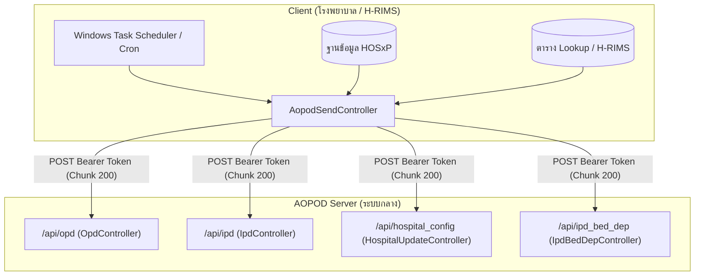

# สรุปโครงสร้างการดึงข้อมูลและส่งข้อมูลจาก Client สู่ระบบ AOPOD (AOPOD Client Data Sending Specification)

เอกสารนี้รวบรวมรายละเอียดการทำงาน การ Query ฐานข้อมูล HOSxP/H-RIMS และรูปแบบการส่งข้อมูล API จากฝั่ง Client (โรงพยาบาล) สู่เซิร์ฟเวอร์ AOPOD โดยอ้างอิงจากตัวประมวลผลต้นทางในไฟล์:
`D:\Project Laravel\h-rims\app\Http\Controllers\Api\AopodSendController.php`

---

## 1. ภาพรวมการทำงาน (Architecture Overview)



### การตั้งค่าพื้นฐานที่ Client (ดึงจากตาราง `main_setting`):
1. **`aopod_token`**: API Bearer Token สำหรับยืนยันตัวตนกับเซิร์ฟเวอร์ AOPOD
2. **`hospital_code`**: รหัสสถานพยาบาล 5 หลัก (`hospcode`)
3. **`bed_qty`**: จำนวนเตียงที่เปิดให้บริการจริงทั้งหมดของโรงพยาบาล
4. **ช่วงวันที่ส่ง (`vstdate` / `dchdate`)**: ค่าเริ่มต้นคือย้อนหลัง **10 วัน** (`Carbon::now()->subDays(10)`) จนถึงวันปัจจุบัน

---

## 2. โครงสร้างข้อมูล 4 ส่วนหลัก และ SQL Query

---

### 2.1 ข้อมูลผู้ป่วยนอก (OPD Records)
- **API Endpoint**: `POST https://huataphanhospital.go.th/aopod/api/opd` (หรือเซิร์ฟเวอร์ AOPOD ที่กำหนด)
- **Header**: `Authorization: Bearer <aopod_token>`, `Idempotency-Key: <hash>`
- **ความถี่**: สรุปรายวัน (`GROUP BY a.vstdate`)

#### ตารางที่ใช้เชื่อมโยง (Tables & Lookups):
| ตาราง HOSxP | หน้าที่ |
| :--- | :--- |
| `ovst`, `vn_stat` | ข้อมูลการรับบริการผู้ป่วยนอก วันที่รับบริการ สิทธิการรักษา และค่าบริการรวม |
| `ipt`, `iptadm` | ตรวจสอบสถานะการนอนโรงพยาบาล (IPD) เพื่อแยก Visit OPD/IPD |
| `pttype`, `ovstist` | ประเภทสิทธิการรักษา และสถานะการมาตรวจ |
| `visit_pttype` | สิทธิการรักษาที่ใช้จริง ตรวจสอบหน่วยบริการหลัก (Incup/Inprov/Outprov) และ Authen EP |
| `opitemrece` | รายการค่าใช้จ่าย ยา เวชภัณฑ์ หัตถการ |
| `dtmain`, `physic_list` | บริการทันตกรรม (Dent) และกายภาพบำบัด (Physic) |
| `health_med_service` | บริการแพทย์แผนไทย (Healthmed) |
| `person_anc_service` | บริการฝากครรภ์ (ANC) |
| `moph_appointment_list` | การนัดหมายผ่านแอปพลิเคชันหมอพร้อม (MOPH Booking) |
| `referout`, `referin`, `refer_reply` | การส่งต่อ/รับผู้ป่วย และการตอบกลับใบส่งต่อ (ในจังหวัด/นอกจังหวัด) |
| `operation_list` | รายการผ่าตัด (Operation) |

#### ตารางเสริม H-RIMS / เคลมชดเชย:
| ตาราง H-RIMS | หน้าที่ |
| :--- | :--- |
| `hrims.lookup_icd10` | ตรวจสอบรหัสโรคส่งเสริมสุขภาพป้องกันโรค (`pp = 'Y'`) |
| `hrims.lookup_hospcode` | จัดกลุ่มโรงพยาบาลในเครือข่าย Cup (`hmain_ucs`), ในจังหวัด (`in_province`) |
| `hrims.lookup_icode` | รหัสรายการเคลมเฉพาะ (`ppfs`, `uc_cr`, `herb32`) |
| `hrims.nhso_endpoint` | ตรวจสอบการยืนยันตัวตน Authen Code สปสช. (`EP%`) |
| `hrims.fdh_claim_status` | ตรวจสอบสถานะการส่งเคลม FDH MOPH |
| `hrims.eclaim_status` / `ovst_eclaim` | ตรวจสอบสถานะการส่งเคลม e-Claim สปสช. |
| `hrims.stm_ucs` | ข้อมูลเงินชดเชย Statement สปสช. (PPFS, DMIS/UCCR, Herbal) |

#### ตัวอย่าง SQL Query OPD:
```sql
SELECT 
    ? AS hospcode, a.vstdate,
    COUNT(DISTINCT a.hn) AS hn_total,
    COUNT(a.vn) AS visit_total,
    SUM(CASE WHEN a.diagtype ="OP" THEN 1 ELSE 0 END) AS visit_total_op,
    SUM(CASE WHEN a.diagtype ="PP" THEN 1 ELSE 0 END) AS visit_total_pp,
    SUM(CASE WHEN a.endpoint ="Y" THEN 1 ELSE 0 END) AS visit_endpoint,
    SUM(CASE WHEN a.hipdata_code IN ("UCS","WEL","DIS") AND a.paidst NOT IN ("01","03") AND a.incup = "Y" THEN 1 ELSE 0 END) AS visit_ucs_incup,
    SUM(CASE WHEN a.hipdata_code IN ("UCS","WEL","DIS") AND a.paidst NOT IN ("01","03") AND a.inprov = "Y" THEN 1 ELSE 0 END) AS visit_ucs_inprov,
    SUM(CASE WHEN a.hipdata_code IN ("UCS","WEL","DIS") AND a.paidst NOT IN ("01","03") AND a.outprov = "Y" THEN 1 ELSE 0 END) AS visit_ucs_outprov,
    SUM(CASE WHEN a.hipdata_code IN ("OFC") AND a.paidst NOT IN ("01","03") THEN 1 ELSE 0 END) AS visit_ofc,
    SUM(CASE WHEN a.hipdata_code IN ("BKK") AND a.paidst NOT IN ("01","03") THEN 1 ELSE 0 END) AS visit_bkk,
    SUM(CASE WHEN a.hipdata_code IN ("BMT") AND a.paidst NOT IN ("01","03") THEN 1 ELSE 0 END) AS visit_bmt,
    SUM(CASE WHEN a.hipdata_code IN ("SSS","SSI") AND a.paidst NOT IN ("01","03") THEN 1 ELSE 0 END) AS visit_sss,
    SUM(CASE WHEN a.hipdata_code IN ("LGO") AND a.paidst NOT IN ("01","03") THEN 1 ELSE 0 END) AS visit_lgo,
    SUM(CASE WHEN a.hipdata_code IN ("NRD","NRH","FWF") AND a.paidst NOT IN ("01","03") THEN 1 ELSE 0 END) AS visit_fss,
    SUM(CASE WHEN a.hipdata_code IN ("STP") AND a.paidst NOT IN ("01","03") THEN 1 ELSE 0 END) AS visit_stp,
    SUM(CASE WHEN (a.paidst IN ("01","03") OR a.hipdata_code IN ("A1","A9")) THEN 1 ELSE 0 END) AS visit_pay,
    COUNT(DISTINCT CASE WHEN inc.ppfs = "Y" THEN a.vn END) AS visit_ppfs,
    COUNT(DISTINCT CASE WHEN inc.ppfs_claim = "Y" THEN a.vn END) AS visit_ppfs_claim,
    COUNT(DISTINCT CASE WHEN a.hipdata_code IN ("UCS","WEL","DIS") AND inc.uccr = "Y" THEN a.vn END) AS visit_ucs_cr,
    COUNT(DISTINCT CASE WHEN a.hipdata_code IN ("UCS","WEL","DIS") AND inc.uccr_claim = "Y" THEN a.vn END) AS visit_ucs_cr_claim,
    COUNT(DISTINCT CASE WHEN a.hipdata_code IN ("UCS","WEL","DIS") AND (a.incup = "Y" OR a.inprov = "Y") AND inc.herb = "Y" THEN a.vn END) AS visit_ucs_herb,
    COUNT(DISTINCT CASE WHEN a.hipdata_code IN ("UCS","WEL","DIS") AND (a.incup = "Y" OR a.inprov = "Y") AND inc.herb_claim = "Y" THEN a.vn END) AS visit_ucs_herb_claim,
    COUNT(DISTINCT CASE WHEN a.dent = "Y" THEN a.vn END) AS visit_dent,
    COUNT(DISTINCT CASE WHEN a.physic = "Y" THEN a.vn END) AS visit_physic,
    COUNT(DISTINCT CASE WHEN a.anc = "Y" THEN a.vn END) AS visit_anc,
    COUNT(DISTINCT CASE WHEN a.telehealth = "Y" THEN a.vn END) AS visit_telehealth,
    COALESCE(ma_booking.cnt, 0) AS visit_moph_oapp_booking,
    COUNT(DISTINCT CASE WHEN a.moph_oapp = "Y" THEN a.cid END) AS visit_moph_oapp,
    COALESCE(op.visit_operation, 0) AS visit_operation,
    SUM(a.income) AS inc_total, 
    SUM(a.inc03) AS inc_lab_total, 
    SUM(a.inc12) AS inc_drug_total,
    SUM(COALESCE(inc.inc_ppfs, 0)) AS inc_ppfs, 
    SUM(COALESCE(inc.inc_ppfs_claim, 0)) AS inc_ppfs_claim, 
    SUM(COALESCE(inc.inc_ppfs_receive, 0)) AS inc_ppfs_receive,
    SUM(CASE WHEN a.hipdata_code IN ("UCS","WEL","DIS") AND a.paidst NOT IN ("01","03") THEN COALESCE(inc.inc_uccr, 0) ELSE 0 END) AS inc_uccr,
    SUM(CASE WHEN a.hipdata_code IN ("UCS","WEL","DIS") AND a.paidst NOT IN ("01","03") THEN COALESCE(inc.inc_uccr_claim, 0) ELSE 0 END) AS inc_uccr_claim,
    SUM(CASE WHEN a.hipdata_code IN ("UCS","WEL","DIS") AND a.paidst NOT IN ("01","03") THEN COALESCE(inc.inc_uccr_receive, 0) ELSE 0 END) AS inc_uccr_receive,
    SUM(CASE WHEN a.hipdata_code IN ("UCS","WEL","DIS") AND (a.incup = "Y" OR a.inprov = "Y") AND a.paidst NOT IN ("01","03") THEN COALESCE(inc.inc_herb, 0) ELSE 0 END) AS inc_herb,
    SUM(CASE WHEN a.hipdata_code IN ("UCS","WEL","DIS") AND (a.incup = "Y" OR a.inprov = "Y") AND a.paidst NOT IN ("01","03") THEN COALESCE(inc.inc_herb_claim, 0) ELSE 0 END) AS inc_herb_claim,
    SUM(CASE WHEN a.hipdata_code IN ("UCS","WEL","DIS") AND (a.incup = "Y" OR a.inprov = "Y") AND a.paidst NOT IN ("01","03") THEN COALESCE(inc.inc_herb_receive, 0) ELSE 0 END) AS inc_herb_receive
    -- และรายได้แยกตามแต่ละสิทธิการรักษา (inc_ucs_*, inc_ofc, inc_sss, inc_lgo ฯลฯ)
FROM (...) a
LEFT JOIN (...) inc ON a.vn = inc.vn
LEFT JOIN (...) rb ON a.vstdate = rb.d
LEFT JOIN (...) op ON a.vstdate = op.d
LEFT JOIN (...) ma_booking ON a.vstdate = ma_booking.d
GROUP BY a.vstdate
ORDER BY a.vstdate;
```

---

### 2.2 ข้อมูลผู้ป่วยใน (IPD Records)
- **API Endpoint**: `POST https://huataphanhospital.go.th/aopod/api/ipd`
- **ความถี่**: สรุปรายวันจำหน่าย (`GROUP BY a.dchdate`)
- **การคัดกรอง**: ตัดโรค `pdx NOT IN ("Z290", "Z208")`

#### ตัวอย่าง SQL Query IPD:
```sql
SELECT 
    ? AS hospcode,
    dchdate,
    COUNT(DISTINCT an) AS an_total,
    SUM(admdate) AS admdate,        
    -- อัตราครองเตียง (%) คำนวณเทียบกับจำนวนวันในเดือนนั้นๆ
    ROUND((SUM(a.admdate) * 100) / (? * CASE 
        WHEN YEAR(a.dchdate) = YEAR(CURDATE()) AND MONTH(a.dchdate) = MONTH(CURDATE()) THEN DAY(CURDATE()) 
        ELSE DAY(LAST_DAY(a.dchdate)) 
    END), 2) AS bed_occupancy,
    -- เตียงที่ใช้งานเฉลี่ยจริงต่อวัน
    ROUND((SUM(a.admdate) / CASE 
        WHEN YEAR(a.dchdate) = YEAR(CURDATE()) AND MONTH(a.dchdate) = MONTH(CURDATE()) THEN DAY(CURDATE()) 
        ELSE DAY(LAST_DAY(a.dchdate)) 
    END), 2) AS active_bed, 
    ROUND(SUM(adjrw) / COUNT(DISTINCT an), 2) AS cmi,
    ROUND(SUM(adjrw), 5) AS adjrw, 
    SUM(income) AS inc_total,
    SUM(inc03) AS inc_lab_total,
    SUM(inc12) AS inc_drug_total
FROM (
    SELECT a.dchdate, a.an, a.admdate, i.adjrw, a.income, a.inc03, a.inc12
    FROM ipt i
    LEFT JOIN an_stat a ON a.an = i.an
    LEFT JOIN pttype p ON p.pttype = a.pttype
    WHERE a.dchdate BETWEEN ? AND ?
      AND a.pdx NOT IN ("Z290","Z208")
    GROUP BY a.an
) AS a
GROUP BY dchdate;
```

---

### 2.3 ข้อมูลเตียงปัจจุบันของโรงพยาบาล (Hospital Config)
- **API Endpoint**: `POST https://huataphanhospital.go.th/aopod/api/hospital_config`
- **หน้าที่**: อัปเดตสถานะจำนวนเตียงที่เปิดให้บริการ และจำนวนเตียงที่กำลังใช้งาน ณ ปัจจุบัน (Real-time snapshot)

#### ตัวอย่าง SQL Query:
```sql
SELECT 
    ? AS hospcode,
    IFNULL((
        SELECT SUM(bed_qty) 
        FROM hrims.lookup_ward 
        WHERE (ward_normal = "Y" OR ward_m = "Y" OR ward_f = "Y" OR ward_vip = "Y")
    ), 0) AS bed_qty,
    IFNULL(COUNT(DISTINCT bedno), 0) AS bed_use
FROM (
    SELECT i.an, i.regdate, i.regtime, i.ward, b.bedno, b.export_code
    FROM ipt i 
    INNER JOIN iptadm ia ON ia.an = i.an
    LEFT JOIN bedno b ON b.bedno = ia.bedno
    WHERE i.confirm_discharge = "N" 
      AND b.export_code IS NOT NULL 
      AND b.export_code <> ""
) AS a;
```

---

### 2.4 ข้อมูลประเภทเตียงและยอดครองเตียงรายแผนก (IPD Bed Department)
- **API Endpoint**: `POST https://huataphanhospital.go.th/aopod/api/ipd_bed_dep`
- **หน้าที่**: ส่งข้อมูลแยกตามรหัสประเภทเตียง (`bed_code` / `export_code`) เช่น เตียงสามัญ, เตียง ICU, เตียงพิเศษ ฯลฯ

#### ตัวอย่าง SQL Query:
```sql
SELECT 
    ? AS hospcode,
    IFNULL(b.export_code, 0) AS bed_code,
    IFNULL(COUNT(DISTINCT b.bedno), 0) AS bed_qty,
    IFNULL(b1.bed_use, 0) AS bed_use
FROM bedno b
LEFT JOIN (
    SELECT b.export_code, COUNT(DISTINCT b.bedno) AS bed_use
    FROM ipt i
    INNER JOIN iptadm ia ON ia.an = i.an
    LEFT JOIN bedno b ON b.bedno = ia.bedno
    WHERE b.export_code IS NOT NULL 
      AND b.export_code <> ""
      AND i.confirm_discharge = "N"
    GROUP BY b.export_code
) b1 ON b1.export_code = b.export_code
WHERE b.export_code IS NOT NULL 
  AND b.export_code <> ""
GROUP BY b.export_code 
ORDER BY b.export_code;
```

---

## 3. รูปแบบข้อมูล JSON ที่ส่งไปยัง API ปลายทาง (Payload Schema)

ข้อมูลทั้งหมดจะถูกบรรจุใน Object `{"records": [...]}` และส่งแบบ Chunk (ครั้งละ 200 รายการ):

### 3.1 ตัวอย่าง Payload: `/api/opd`
```json
{
  "records": [
    {
      "vstdate": "2026-09-21",
      "hn_total": 350,
      "visit_total": 420,
      "visit_total_op": 380,
      "visit_total_pp": 40,
      "visit_endpoint": 395,
      "visit_ucs_incup": 260,
      "visit_ucs_inprov": 35,
      "visit_ucs_outprov": 15,
      "visit_ofc": 45,
      "visit_sss": 25,
      "visit_lgo": 10,
      "visit_pay": 30,
      "visit_dent": 45,
      "visit_physic": 20,
      "visit_healthmed": 35,
      "visit_moph_oapp": 28,
      "visit_referout_inprov": 8,
      "visit_referout_outprov": 2,
      "inc_total": 385000.50,
      "inc_drug_total": 145000.00,
      "inc_lab_total": 52000.00,
      "inc_ppfs": 18500.00,
      "inc_ppfs_claim": 18500.00,
      "inc_ppfs_receive": 15200.00,
      "inc_uccr": 42000.00,
      "inc_uccr_claim": 42000.00,
      "inc_uccr_receive": 38000.00
    }
  ]
}
```

### 3.2 ตัวอย่าง Payload: `/api/ipd`
```json
{
  "records": [
    {
      "dchdate": "2026-09-21",
      "an_total": 18,
      "admdate": 65,
      "bed_occupancy": 72.22,
      "active_bed": 21.67,
      "cmi": 1.34,
      "adjrw": 24.12000,
      "inc_total": 245000.00,
      "inc_lab_total": 38000.00,
      "inc_drug_total": 85000.00
    }
  ]
}
```

### 3.3 ตัวอย่าง Payload: `/api/hospital_config`
```json
{
  "records": [
    {
      "hospcode": "10670",
      "bed_qty": 30,
      "bed_use": 22
    }
  ]
}
```

### 3.4 ตัวอย่าง Payload: `/api/ipd_bed_dep`
```json
{
  "records": [
    {
      "bed_code": "1",
      "bed_qty": 20,
      "bed_use": 15
    },
    {
      "bed_code": "2",
      "bed_qty": 6,
      "bed_use": 4
    },
    {
      "bed_code": "3",
      "bed_qty": 4,
      "bed_use": 3
    }
  ]
}
```

---

## 4. กลไกความปลอดภัยและความถูกต้อง (Reliability & Security)

1. **การตรวจสอบสิทธิ์ฝั่งส่ง (Client Authorization)**:
   - ตรวจสอบ `auth()->check()` (ผู้ใช้ที่ล็อกอินในระบบ)
   - ตรวจสอบ Localhost IP (`127.0.0.1`, `::1`) สำหรับรันผ่าน Windows Task Scheduler
   - ตรวจสอบผ่าน Header `X-SCHEDULE-KEY` หรือ Query `?key=` โดยเปรียบเทียบกับ `schedule_secret_key` หรือแฮช SHA-256 ของ `hospital_code` + `app.key`
2. **Idempotency Key**:
   - Client จะสร้าง Header `Idempotency-Key` โดยการแฮช SHA-256 จาก `hospcode|PREFIX|dates` เพื่อป้องกันการประมวลผลข้อมูลซ้ำซ้อนในกรณีที่มีการ Retry
3. **HTTP Retry & Timeout**:
   - ฝั่ง Client ใช้ `Http::withToken($token)->timeout(20)->retry(3, 300)` รองรับกรณีเครือข่ายกระตุก
4. **การบันทึก Log**:
   - ฝั่ง Client บันทึกสรุปผลการส่งข้อมูลรายวันลงใน `aopod_schedule.log` โดยเก็บย้อนหลัง 24 ชั่วโมง
